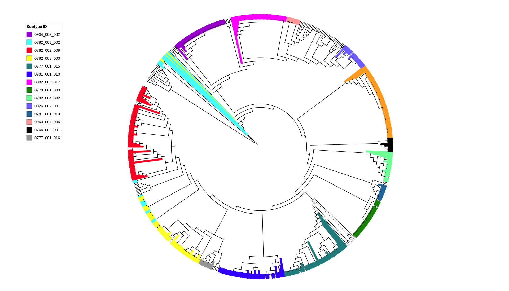

```{r setup, include=FALSE}
knitr::opts_chunk$set(echo = FALSE)
library(DiagrammeR)
library(ggplot2)
library(gplots)
library(viridis)

```

# Background

*Campylobacter* is an important foodborne bacterial pathogen, affecting millions of people worldwide every year [@oh2015high]. Despite high numbers of infections, *Campylobacter* outbreaks are not well reported and metadata on outbreaks in humans is lacking [@mutschall2020campylobacter]. *Campylobacter* is capable of colonizing a wide array of animals, including farm, wild, and domestic animals, and can also be found in the environment (water and soil) [@oh2015high]. Raccoons (*Procyon lotor*) are hosts for *Campylobacter* and have a wide range of habitats (urban, rural, and natural woodland), and have the potential to move between habitats. Raccoons are therefore able to access farmland and are also able to live in close proximity to humans, and have been found to harbour *Campylobacter* strains associated with agriculture and with causing human sickness [@mutschall2020campylobacter]. Raccoons sampled in this study had more complete metadata tracked than typical human outbreaks. 

## Purpose

Use whole genome sequencing (WGS) data with cgMLST to investigate genetic similarities between *Campylobacter* isolates from a wild raccoon population and the transmission of *Campylobacter* within raccoons. Understanding the dynamics of *Campylobacter* in wild raccoons may be used to develop a model for outbreak detection, which may be applied to humans in the future. 

# Methods

Wild raccoon trapping occurred during the spring and summer seasons of May 2011 to November 2013 on swine farms and conservation areas near Guelph and Cambridge, Ontario. Trapped raccoons therefore represent a population of wild raccons from southern Ontario. Metadata for individual raccoons were tracked. Fecal samples were obtained and processed according to Figure \@ref(fig:methodFlowchart) [@jokinen2012enhanced]. Data cleaning and data generation are described in Figure \@ref(fig:methodflow2). Previous analyses conducted on this raccoon dataset was based on presence/absence of 40 accessory genes with Comparative Genomic Fingerprinting (CGF) PCR [@mutschall2020campylobacter]. CGF subtypes were compared with the Canadian *Campylobacter* Comparative Genomic Fingerprinting Database. Core Genome Multilocus Sequence Typing (cgMLST) measures inter-genomic distance based on allelic profiles of *Campylobacter* core genome [@barker2018principles]. 

```{r methodFlowchart, out.height = '95%', fig.align='center', fig.cap="Workflow of *Campylobacter* isolation and species confirmation"}
grViz("digraph flowchart {
      node [fontname = Helvectica, shape = rectangle]
      tab1 [label = '@@1']
      tab2 [label = '@@2']
      tab3 [label = '@@3']
    
      
      #edge definitions with the node
      tab1 -> tab2 -> tab3;
      }

      [1]: 'Raccoons (n= 1096) live-trapped and fecal samples obtained'
      [2]: 'Campylobacter isolated\\nand the species identity confirmed with PCR'
      [3]: 'CGF PCR performed on all Campylobacter isolates to\\nobtain binary fingerpints, which were assigned a subtype'
      
      ")
```


```{r methodflow2, out.width='100%', out.height= '150%', fig.align='center', fig.cap= 'Workflow of data generation and cleaning'}
grViz("digraph flowchart {
                 node [fontname = Helvectica, shape = rectangle,
                 fontsize = 36]
                 tab1 [label = '@@1']
                 tab2 [label = '@@2']
                 tab3 [label = '@@3']
                 tab4 [label = '@@4']
                 tab5 [label = '@@5']
                 tab6 [label = '@@6']
                 tab7 [label = '@@7']
                 tab8 [label = '@@8']
                 tab9 [label = '@@9']
                 
                 
                 tab1 -> tab9;
                 tab9 -> tab4;
                 tab9 -> tab2 ->  tab6 -> tab8 -> tab3 -> tab5;
                 tab6 -> tab7
}

[1]: '895 isolates sequenced on NextSeq platform'
[2]: 'Genomes (614) with complete allele calls across all loci.\\nLoci (685) with complete alleles across all genomes'
[3]: 'Pairwise genome comparisons\\nto calculate genetic similarity\\nusing GrapeTree'
[4]: 'Genomes and loci with missing,\\n truncated, or short alleles discarded'
[5]: 'Distance matrix'
[6]: 'CGF profiles compared with eCGF'
[7]: 'Mismatches discarded'
[8]: 'Postive match between CGF and eCGF\\n(n=589)'
[9]: 'cgMLST allele calls'
")
```


# Results


```{r distanceheatmap, out.width='95%', fig.align='center', fig.cap= 'Heatmap of distance matrix for pairwise comparisons'}
distancemat <- as.matrix(read.csv("data/Genomes_A_DM.csv", row.names=1, header = TRUE))

heatmap.2(distancemat,
          distfun = function(x) {as.dist(x)},
          symm=TRUE,
          tracecol = NA,
          revC=TRUE,
          col = viridis::inferno,
          denscol = 'black',
          labRow = FALSE,
          labCol = FALSE,
          density.info = 'density',
          key.title = NA,
          key.ylab = NA,
          key.xlab = "cgMLST Distance",
          #key.ytickfun = function(x) {list(NA)}
          )
```

The heatmap shows degrees of genetic relatedness between genome pairs. Genetically similar isolates formed discrete clusters. 


```{r Tree, echo=FALSE, out.width= '100%', fig.cap= 'Dendogram of cgMLST alleles, each colour represents a CGF subtype'}


```
In general, isolates with the same CGF subtype clustered together. 


```{r SimvsCluster, out.width= '80%', fig.align= 'center', fig.cap= 'Average Genetic Similarity vs CGF Cluster Identity. Individual bars represents a CGF cluster. Increasing average distance represents increasing genetic disimilarity. '}
simvstime <- read.csv("data/distance_dayst.csv", header = TRUE)

ggplot(simvstime,
       aes(x = reorder(Cluster, -AverageDistance),
           y = AverageDistance)) +
  geom_bar(stat = "identity", color = "black", 
           width = 1, fill = "#008080") +
  labs(x = "CGF Cluster Identity",
       y = "Average Distance") +
  theme_bw() +
  theme(axis.text.x = element_blank())

#38 CGF clusters

```

Some CGF clusters had great genetic variability whereas other clusters were highly similar or near identical. Despite belonging to the same CGF cluster, genetic similarity could be highly variable (6 subtypes had >50 allele differences), which would not be detected based on CGF cluster data alone. 


```{r SimvsTime, out.width= '80%', fig.align='center', fig.cap= 'Average genetic similarity by standard deviation of the average running day for CGF clusters. Low average distance indicates high genetic similarity. Low standard deviation of time indicates a smaller window of time'}
simvstime <- read.csv("data/distance_dayst.csv", header = TRUE)

ggplot(simvstime,
       aes(x = Day.STDev,
           y = AverageDistance)) +
  geom_point(aes(size = Obs),
             alpha = 0.8,
             stroke = 1,
             shape = 1) +
  labs(x = "Standard Deviation of Time",
       y = "Average Distance",
       size = "Observations") +
  theme_classic()


```

CGF clusters containing a substantial number of genomes that had both low average distance and low standard deviations of time may be considered outbreaks of *C. jejuni* within the raccoon population. Clusters with both large observations and low average distance, but high standard deviations of time may represent subtypes that are circulating within the wild raccoon population. 


# Conclusion

- WGS data used for cgMLST provides higher resolution for comparison of genetic similarity between isolates, providing greater context on genetic similarity compared to CGF cluster data.
- Isolates with the same CGF subtype generally clustered together, indicating genetic similarity within subtypes. 
- Genetic variablility of CGF clusters could be variable or highly similar. 
- Genetic similarity can be paired with the time of raccoon sampling and assigned CGF subtypes to identify potential outbreaks vs potential endemic subtypes within this raccoon population from southern Ontario, as an example of an analysis that can be conducted. 


Ultimately, this dataset will be used to develop approaches applicable to human surveillance of *Campylobacter*.

# Next Steps


- Determine identical strains in the context of this dataset by determining thresholds (isolates are obtained from the same animal at the same time and are genetically similar)
- Analyze the survival time of a strain within a raccoon to determine if the strain is transient or being harboured
- Model transmission and outbreak detection of *Campylobacter* in raccoons and apply model to *Campylobacter* cases in humans
 

# Acknowledgements

Funding was provided through GA3GP. 

Barker, Dillon OR. 2018. Thesis, University of Lethbridge.  
Jokinen, Cassandra C., et al. 2012. *Journal of Microbiological Methods*.  
Mutschall, Steven K., et al. 2020. *Frontiers in Veterinary Science*.  
Oh, Euna, et al. 2015. *Frontiers in Microbiology*.  
