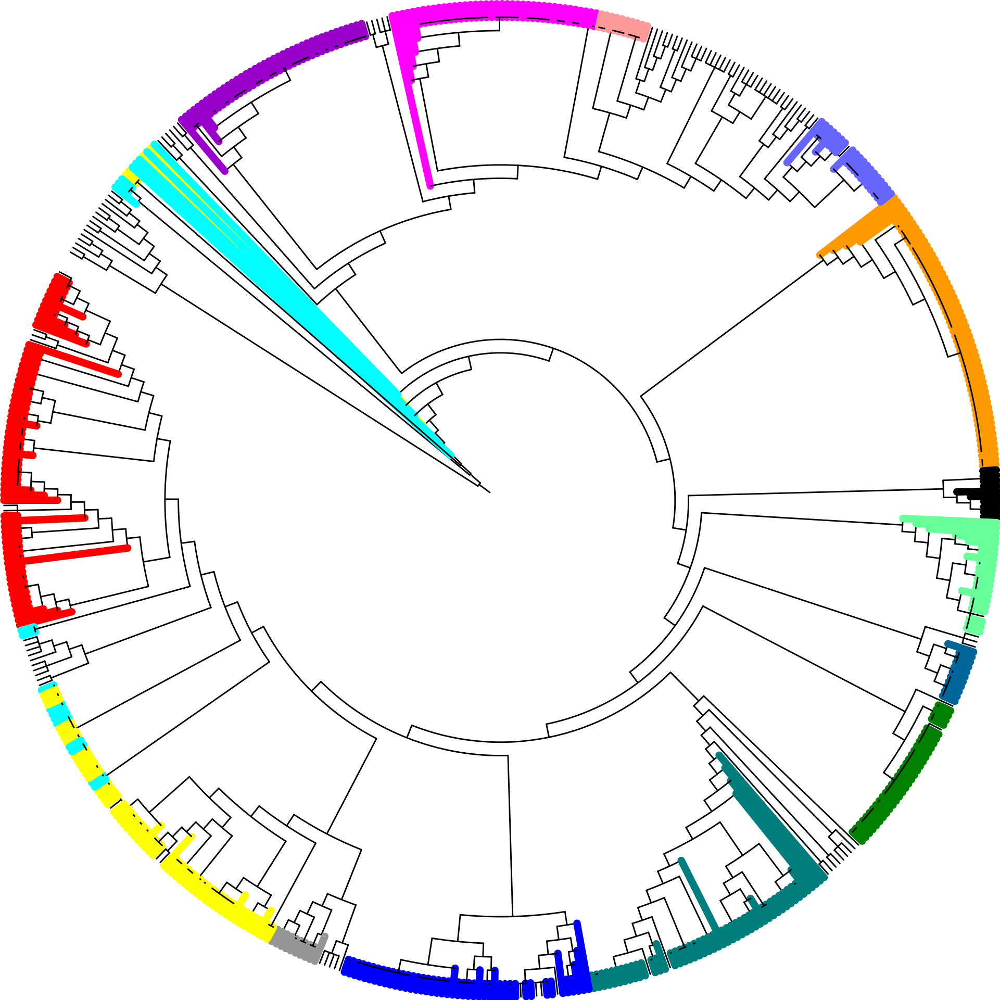

```{r setup, include=FALSE}
knitr::opts_chunk$set(echo = FALSE)
library(DiagrammeR)
library(ggplot2)
library(gplots)
library(viridis)

```

# Background

- *Campylobacter* is an important foodborne pathogen, affecting millions of people worldwide every year [@oh2015high].
-	*Campylobacter* is capable of colonizing a wide array of humans and animals, including farm animals, wild and domestic animals, and can also be found in the environment (water and soil) [@oh2015high]. 
-	Raccoons (*Procyon lotor*) have a wide range of habitats, including urban and rural areas, in addition to natural environments. 
-	Raccoons’ potential for movement between different types of habitats make them ideal subjects for investigating the role that wildlife may play in the transmission of *Campylobacter*. [@mutschall2020campylobacter]
- Previous analyses conducted on this raccoon dataset was based on presence/absence of 40 accessory genes with Comparative Genomic Fingerprinting (CGF) [@mutschall2020campylobacter]. 
- Core Genome Multilocus Sequence Typing (cgMLST) measures inter-genomic distance based on allelic profiles of *Campylobacter* core genome. 


## Purpose

- Use whole genome sequencing (WGS) data with cgMLST to investigate genetic similarities between *Campylobacter* isolates from a wild raccoon population. 

# Methods

Wild raccoon trapping occurred during the spring and summer seasons of May 2011 to November 2013 on swine farms and conservation areas near Guelph and Cambridge in Southern Ontario, Canada. Fecal samples were obtained and processed according to Figure \@ref(fig:methodFlowchart). Data cleaning and data generation are described in Figure \@ref(fig:methodflow2). 

```{r methodFlowchart, out.width= '95%', fig.align='center', fig.cap="Workflow of *Campylobacter* isolation and species confirmation"}
grViz("digraph flowchart {
      node [fontname = Helvectica, shape = rectangle]
      tab1 [label = '@@1']
      tab2 [label = '@@2']
      tab3 [label = '@@3']
    
      
      #edge definitions with the node
      tab1 -> tab2 -> tab3;
      }

      [1]: 'Raccoons (n= 1096) live-trapped and fecal samples obtained'
      [2]: 'Campylobacter isolated\\nand the species identity confirmed with PCR'
      [3]: 'CGF PCR performed on all Campylobacter isolates to\\nobtain binary fingerpints, which were assigned a subtype'
      
      ")
```


```{r methodflow2, out.width= '95%', fig.align='center', fig.cap= 'Workflow of data generation and cleaning'}
grViz("digraph flowchart {
                 node [fontname = Helvectica, shape = rectangle,
                 fontsize = 30]
                 tab1 [label = '@@1']
                 tab2 [label = '@@2']
                 tab3 [label = '@@3']
                 tab4 [label = '@@4']
                 tab5 [label = '@@5']
                 tab6 [label = '@@6']
                 tab7 [label = '@@7']
                 tab8 [label = '@@8']
                 tab9 [label = '@@9']
                 
                 
                 tab1 -> tab9;
                 tab9 -> tab4;
                 tab9 -> tab2 ->  tab6 -> tab8 -> tab3 -> tab5;
                 tab6 -> tab7
}

[1]: '895 isolates sequenced on NextSeq platform'
[2]: 'Genomes (614) with complete allele calls across all loci.\\nLoci (685) with complete alleles across all genomes'
[3]: 'Pairwise genome comparisons\\nto calculate genetic similarity\\nusing GrapeTree'
[4]: 'Genomes and loci with missing,\\n truncated, or short alleles discarded'
[5]: 'Distance matrix'
[6]: 'CGF profiles compared with eCGF'
[7]: 'Mismatches discarded'
[8]: 'Postive match between CGF and eCGF\\n(n=589)'
[9]: 'cgMLST allele calls'
")
```


# Results


```{r distanceheatmap, out.width='80%', fig.align='center', fig.cap= 'Heatmap of distance matrix for pairwise comparisons'}
distancemat <- as.matrix(read.csv("data/Genomes_A_DM.csv", row.names=1, header = TRUE))

heatmap.2(distancemat,
          distfun = function(x) {as.dist(x)},
          symm=TRUE,
          tracecol = NA,
          revC=TRUE,
          col = viridis::inferno,
          denscol = 'black',
          labRow = FALSE,
          labCol = FALSE,
          density.info = 'density',
          key.title = NA,
          key.ylab = NA,
          key.xlab = "cgMLST Distance",
          #key.ytickfun = function(x) {list(NA)}
          )
```

The heatmap shows degrees of genetic relatedness between genome pairs. Genetically similar isolates formed discrete clusters. 


```{r Tree, echo=FALSE, out.width= '100%', fig.cap= 'Dendogram of cgMLST alleles'}


```
CGF subtypes projected onto cgMLST dendogram. Isolates highlighted with the same colour belong to the same CGF subtype. In general, isolates with the same CGF subtype clustered together. 


```{r SimvsCluster, out.width= '80%', fig.align= 'center', fig.cap= 'Genetic Similarity vs CGF Cluster'}
simvstime <- read.csv("data/distance_dayst.csv", header = TRUE)

ggplot(simvstime,
       aes(x = reorder(Cluster, -AverageDistance),
           y = AverageDistance)) +
  geom_bar(stat = "identity", color = "black", 
           width = 1, fill = "#008080") +
  labs(x = "CGF Cluster Identity",
       y = "Average Distance") +
  theme_bw() +
  theme(axis.text.x = element_blank())

#38 CGF clusters

```
Average distance of genetic similarity by CGf Cluster Identity. Greater average distance represents increasing genetic disimiarlity. CGF clusters had 0 differences, based on 40 accessory genes. Some CGF clusters had great genetic variability whereas other clusters were highly similar or near identical. Despite belonging to the same CGF cluster, genetic similarity could be highly variable (6 subtypes with >50 allele differences), which would not be detected based on CGF cluster data alone. 


```{r SimvsTime, out.width= '80%', fig.align='center', fig.cap= 'Genetic similarity by standard deviation of the average running day for CGF clusters'}
simvstime <- read.csv("data/distance_dayst.csv", header = TRUE)

ggplot(simvstime,
       aes(x = Day.STDev,
           y = AverageDistance)) +
  geom_point(aes(size = Obs),
             alpha = 0.8,
             stroke = 1,
             shape = 1) +
  labs(x = "Standard Deviation of Time",
       y = "Average Distance",
       size = "Observations") +
  theme_classic()


```

Average genetic distance by standard deviation of time. Low average distance indicates high genetic similarity, with 0 indicating complete genomic similarity. Low standard deviation of time indicates a smaller window of time that isolates were obtained, with 0 being the same day. CGF Clusters with a substantial number of genome pair observations that had both low average distance and standard deviations of time may be considered outbreaks of *C. jejuni* within the raccoon population. Clusters with large observations and low average distance, but high standard deviations of time are considered to be circulating within the population. 


# Conclusion

- WGS data used for cgMLST provides higher resolution for comparison of genetic similarity between isolates, providing greater context on genetic similarity compared to CGF cluster data.
- Isolates with the same CGF subtype generally clustered together, indicating genetic similarity within subtypes. 
- Genetic variablility of CGF clusters could be variable or highly similar. 
- Genetic similarity can be paired with time of raccoon sampling and CGF subtype to identify potential outbreaks vs potential endemic subtypes, as an example of an analysis that can be conducted with this dataset. 


Ultimately, this dataset will be used to develop approaches applicable to human surveillance of *Campylobacter*.

# Next Steps


- Determine identical strains in the context of this dataset by determining thresholds (isolates are obtained from the same animal at the same time and are genetically similar)
- Analyze the survival time of a strain within a raccoon to determine if the strain is transient or being harboured
 

# Acknowledgements

Financial support for this work was provided through Genome Alberta's Applied Agricultural Genomics Program. 

```{r, include=FALSE}
knitr::write_bib(c('knitr','rmarkdown','posterdown','pagedown'), 'packages.bib')
```

# References
